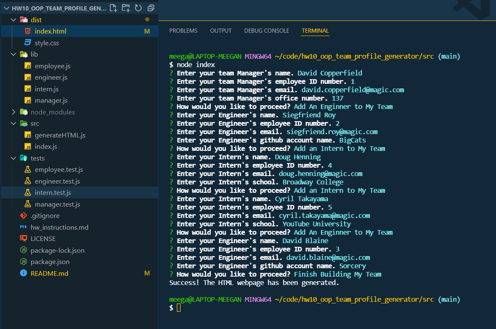

# Team Profile Generator


## Description

- Purpose of this project: To generate an HTML webpage that displays a team profile with basic employee information.
- Problem(s) the app solves: Not having quick and easy access to team member information.
- Languages used: HTML, CSS, JavaScript (Node.js)
- Brief description: A Node.js command-line application that takes in information about employees on a software engineering team and then generates an HTML webpage that displays summeries for each person.

## Table of Contents

- [Installation](#installation)
- [Usage](#usage)
- [License](#license)
- [Contributing](#contributing)
- [Tests](#tests)
- [Questions](#questions)
- [Links](#links)

## Installation

This app requires installation of Inquirer to function, as well as Jest for testing. Both can be installed from npmjs.com using the following inputs:

```bash
npm i inquirer
```

```bash
npm i jest
```

## Usage

This is a command-line application invoked by using the following command:

```bash
node index.js
```

When the user starts the application, they are prompted to enter the team manager’s name, employee ID, email address, and office number. After entering the requested information, they are presented with a menu with the option to add an engineer, add an intern, or to finish building their team. When they select the engineer option, they are prompted to enter the engineer’s name, ID, email, and GitHub username, and are taken back to the menu. When they select the intern option, they are prompted to enter the intern’s name, ID, email, and school, and are taken back to the menu. When they decide to finish building their team, they exit the application, and the HTML is generated.

The generated HTML displays a nicely formatted team roster based on user input. When the user clicks on an email address in the HTML, then their default email program opens and populates the TO field of the email with the address. When the user clicks on the GitHub username, then that GitHub profile opens in a new tab.

## Screenshot of Terminal Using Command-Line Application



## Screenshot of Terminal Using Jest For Testing Libraries


## Screenshot of a Generated HTML Example

!["Screen shot of the application on a computer screen. The background is a grey-purple. The header is a brighter purple with white text reading 'My Team'. The footer is the same purple with white text reading 'Made with ♡ and OOP by Meegan'. Arranged in the center are dark pink cards with rounded corners and a black border. The tops of the cards have the names of the employees, the employee role, and an icon related to that role. The bottoms of the cards have the employee's ID, email address, and a third descriptor: office number for managers, github account name for enginners, and school for interns."](./img/hw10_ss.PNG)

## License

This application is licensed under the MIT license.

## Contributing

If you would like to contribute to this application, please follow the Contributor Covenant guidelines.

## Tests

You can test this application through utilizing Jest and run the tests in the tests folder. All the tests can be invoked using the following command:

```bash
npm test
```

Or can be tested individually through these commands:

```bash
npm test employee
```

```bash
npm test engineer
```

```bash
npm test intern
```

```bash
npm test manager
```

You can also enter unexpected inputs in the inquirer prompts.

## Questions

If you have any questions:

- Email me: [meegan.r.anderson@gmail.com](mailto:meegan.r.anderson@gmail.com)
- Go to my github: [NotANewt](https://github.com/NotANewt)

## Links

- Here is the repo: [NotANewt/hw10_oop_team_profile_generator](https://www.github.com/NotANewt/hw10_oop_team_profile_generator)
- Here is the walkthrough video: [Team Profile Generator Walkthrough](https://drive.google.com/file/d/13IRO4ypMX6kk1WQGvA7HZPGAFRau1x0W/view)
- Here is the page generated during the walkthrough video: [NotANewt/Generated Page](https://notanewt.github.io/hw10_oop_team_profile_generator/)
